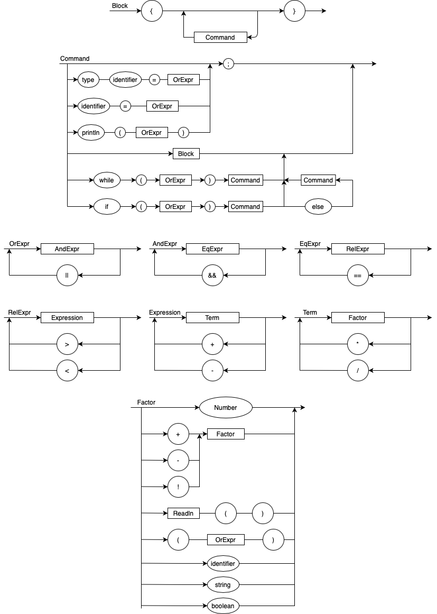

# logcomp-compilador-2021
Repositorio dedicado a matéria de Lógica da Computação.

# Status dos Testes


## EBNF

```
BLOCK = "{",  {COMMAND}, "}";
COMMAND = ASSIGN | PRINT | BLOCK | WHILE | IF

ASSIGN = IDENTIFIER, "=", OREXPR;
PRINT = "println", "(", OREXPR, ")";
WHILE = "while", "(", OREXPR, ")", COMMAND;
IF = "if", "(", OREXPR, ")", COMMAND |
     "if", "(", OREXPR, ")", COMMAND, "else", COMMAND;

OREXPR = ANDEXPR, {"||", ANDEXPR};
ANDEXPR = EQEXPR, {"&&", EQEXPR};
EQEXPR = RELEXPR, {"==", RELEXPR};
RELEXPR = EXPRESSION, {(">" | "<"), EXPRESSION};
EXPRESSION = TERM, {("+" | "-"), TERM} ;
TERM = FACTOR, {("*" | "/"), FACTOR} ;
FACTOR = ("+" | "-", "!"), FACTOR | "(", OREXPR, ")" | NUMBER | IDENTIFIER | READLN | STRING | BOOLEAN;

IDENTIFIER = VTYPE, ALPHACHAR, {CHAR};
READLN = "readln", "(", ")";

NUMBER = DIGIT, {DIGIT} ;
DIGIT = 0 | 1 | ... | 9 ;

BOOLEAN = "true" | "false";

STRING = """, {CHAR | SPACE}, """; 

CHAR = ALPHACHAR | DIGIT | "_";
ALPHACHAR = "A" | "B" | "C" | "D" | "E" | "F" | "G"
       | "H" | "I" | "J" | "K" | "L" | "M" | "N"
       | "O" | "P" | "Q" | "R" | "S" | "T" | "U"
       | "V" | "W" | "X" | "Y" | "Z" | "a" | "b"
       | "c" | "d" | "e" | "f" | "g" | "h" | "i"
       | "j" | "k" | "l" | "m" | "n" | "o" | "p"
       | "q" | "r" | "s" | "t" | "u" | "v" | "w"
       | "x" | "y" | "z" ;
SPACE = " ";

VTYPE = "int" | "bool" | "string";
```

## Diagrama


